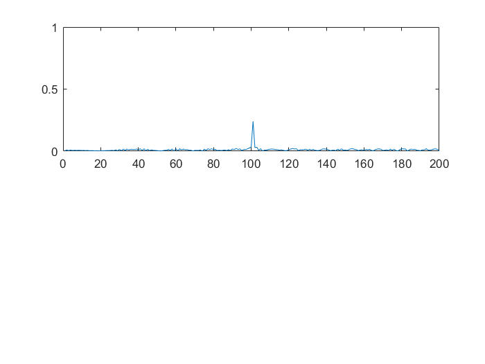
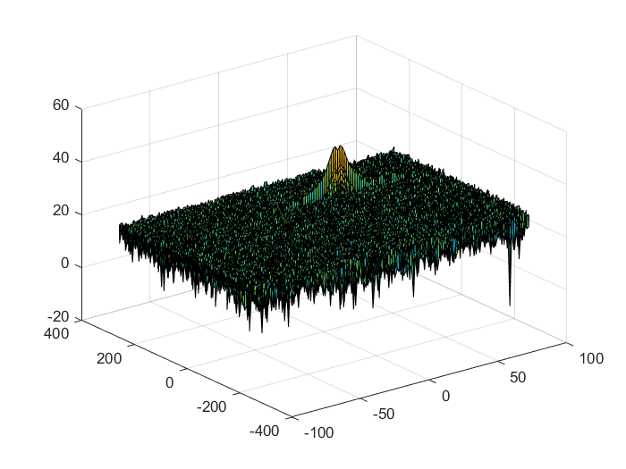
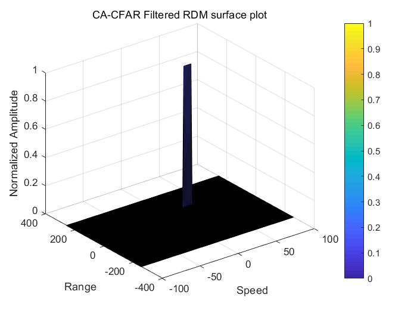

# SFND_Radar_Target_Generation_Detection

### Project Overview

- Configure the FMCW waveform based on the system requirements.
- Define the range and velocity of target and simulate its displacement.
- For the same simulation loop process the transmit and receive signal to determine the beat signal
- Perform Range FFT on the received signal to determine the Range
- Towards the end, perform the CFAR processing on the output of 2nd FFT to display the target.

### Steps 
1. Radar specifications
```matlab
%%%%%%%%%%%%%%%%%%%%%%%%%%%
% Frequency of operation = 77GHz
% Max Range = 200m
% Range Resolution = 1 m
% Max Velocity = 100 m/s
%%%%%%%%%%%%%%%%%%%%%%%%%%%

%speed of light = 3e8
max_range=200;
c=3e8;
range_resolution=1;
%Operating carrier frequency of Radar 
fc= 77e9;             %carrier freq
%Target specifications
target_pos=100;
target_speed=30;
```

2. FMCW Waveform Generation 

```matlab
% *%TODO* :
%Design the FMCW waveform by giving the specs of each of its parameters.
% Calculate the Bandwidth (B), Chirp Time (Tchirp) and Slope (slope) of the FMCW
% chirp using the requirements above.
B_sweep = c/(2*range_resolution);
Tchirp=5.5*2*max_range/c;
slope=B_sweep/Tchirp;
Nd=128;                   % #of doppler cells OR #of sent periods % number of chirps
Nr=1024;                  %for length of time OR # of range cells
t=linspace(0,Nd*Tchirp,Nr*Nd); %total time for samples

%% Signal generation and Moving Target simulation
% Running the radar scenario over the time. 
for i=1:length(t)         
    
    % *%TODO* :
    %For each time stamp update the Range of the Target for constant velocity. 
    r_t(i) = target_pos+(target_speed*t(i));
    td(i) = 2*r_t(i)/c; % Time delay    
    
    % *%TODO* :
    %For each time sample we need update the transmitted and
    %received signal. 
    Tx(i) = cos(2 * pi * (fc * t(i) + slope * (t(i)^2)/2));
    Rx(i) = cos(2 * pi * (fc * (t(i) - td(i)) + slope * ((t(i)-td(i))^2)/2));
    
    % *%TODO* :
    %Now by mixing the Transmit and Receive generate the beat signal
    %This is done by element wise matrix multiplication of Transmit and
    %Receiver Signal
    Mix(i) = Tx(i) .* Rx(i);
    
end
```
3. FFT Operation
 - Range Measurement
 ```matlab
% *%TODO* :
%reshape the vector into Nr*Nd array. Nr and Nd here would also define the size of
%Range and Doppler FFT respectively.
Mix_reshape = reshape(Mix,[Nr,Nd]);
%normalize.
sig_fft1=fft(Mix_reshape,Nr)./Nr;
% Take the absolute value of FFT output
sig_fft1=abs(sig_fft1);
% Hence we throw out half of the samples.
sig_fft1=sig_fft1(1:Nr/2);
figure ('Name','Range from First FFT')
subplot(2,1,1)
```
 
 
 - Range Doppler Response
 ```matlab
 % to range and doppler based on their Max values.
 Mix=reshape(Mix,[Nr,Nd]);
 % 2D FFT using the FFT size for both dimensions.
sig_fft2 = fft2(Mix,Nr,Nd);
% Taking just one side of signal from Range dimension.
sig_fft2 = sig_fft2(1:Nr/2,1:Nd);
sig_fft2 = fftshift (sig_fft2);
RDM = abs(sig_fft2);
RDM = 10*log10(RDM) ;
%use the surf function to plot the output of 2DFFT and to show axis in both
%dimensions
doppler_axis = linspace(-100,100,Nd);
range_axis = linspace(-200,200,Nr/2)*((Nr/2)/400);
figure,surf(doppler_axis,range_axis,RDM);
 ```
 

4. 2D CFAR
 - Implementation steps for the 2D CFAR process.
 The 2D CA-CFAR implementation involves the training cells occupying the cells surrounding the cell under test with a guard grid in between to prevent the impact of a target signal on the noise estimate.
 
 - Selection of Training, Guard cells and offset.
 ```matlab
%Select the number of Training Cells in both the dimensions.
Tr=10;
Td=8;

% *%TODO* :
%Select the number of Guard Cells in both dimensions around the Cell under 
%test (CUT) for accurate estimation
Gr=4;
Gd=4;

% *%TODO* :
% offset the threshold by SNR value in dB
off_set=1.4;
 ```
 - Slide the cell under test across the complete martix <br>
 & Steps taken to suppress the non-thresholded cells at the edges.
 ```matlab
 %Slide the cell under test across the complete martix,to note: start point
%Tr+Td+1 and Td+Gd+1
for i = Tr+Gr+1:(Nr/2)-(Tr+Gr)
    for j = Td+Gd+1:(Nd)-(Td+Gd)
        %Create a vector to store noise_level for each iteration on training cells
        noise_level = zeros(1,1);
        %Step through each of bins and the surroundings of the CUT
        for p = i-(Tr+Gr) : i+(Tr+Gr)
            for q = j-(Td+Gd) : j+(Td+Gd)
                %Exclude the Guard cells and CUT cells
                if (abs(i-p) > Gr || abs(j-q) > Gd)
                    %Convert db to power
                    noise_level = noise_level + db2pow(RDM(p,q));
                end
            end
        end
        
        %Calculate threshould from noise average then add the offset
        threshold = pow2db(noise_level/(2*(Td+Gd+1)*2*(Tr+Gr+1)-(Gr*Gd)-1));
        %Add the SNR to the threshold
        threshold = threshold + off_set;
        %Measure the signal in Cell Under Test(CUT) and compare against
        CUT = RDM(i,j);
        
        if (CUT < threshold)
            RDM(i,j) = 0;
        else
            RDM(i,j) = 1;
        end
        
    end
end
 ```
 
